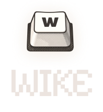

<div align="center">
	
	<br>
	<a href="https://github.com/kh4f/wike/releases"></a>&nbsp;
	<a href="https://github.com/kh4f/wike/issues?q=is%3Aissue+is%3Aopen+label%3Abug"></a>&nbsp;
	<a href="https://github.com/kh4f/wike/blob/master/LICENSE"></a>&nbsp;
	<br><br>
	A fast, lightweight, and flexible <b>hotkey manager</b> for Windows
	<br><br>
	<b>
		<a href="#-features">Features</a>&nbsp; •&nbsp;
		<a href="#-installation">Installation</a>&nbsp; •&nbsp;
		<a href="#%EF%B8%8F-usage">Usage</a>&nbsp; •&nbsp;
		<a href="#%EF%B8%8F-configuration">Configuration</a>
	</b>
</div>

## 🔥 Features

- Keyboard & mouse remapping
- Region‑aware hotkeys
- Multi‑key actions & app launching
- Launch at Windows startup
- Simple YAML configuration

## 📥 Installation

Download and extract the [latest release](https://github.com/kh4f/wike/releases/latest).

## 🕹️ Usage

Control the app from the command line with `Wike.exe`:

```
🕹️ Wike v0.5.0

Actions:
  1) Start daemon
  2) Add to startup
  3) Monitor events
  4) Exit
```

- `Start daemon` launches `WikeDaemon.exe` in the background to enable the hotkeys.
- `Add to startup` enables automatic launch on system startup.
- `Monitor events` is useful for debugging - logs all input events and triggered rules in real time.

## ⚙️ Configuration

Wike uses a single `config.yml` file for configuration. Below is a compact example demonstrating the main features:

```yaml
rules:
  - name: Caps Lock → F13 # "Rule UNK" by default
    enabled: true # true by default
    trigger: { kb: CAPITAL } # trigger when Caps Lock is pressed
    action: { kb: [F13] } # simulate pressing F13
    consume: true # prevent the original Caps Lock event (true by default)

  - name: Volume Scroll
    # define multiple bindings within a single rule
    bindings:
      - trigger: { m: WHEEL, state: UP } # mouse wheel up
        action: { kb: [VOLUME_UP] } # increase volume
      - trigger: { m: WHEEL, state: DOWN } # mouse wheel down
        action: { kb: [VOLUME_DOWN] } # decrease volume
    # screen region where the rule is active
    # negative values are relative to the right/bottom edges
    # defaults: x1: 0, y1: 0, x2: <screen width>, y2: <screen height>
    region: { x1: -1, y1: -500 }

  - name: PowerToys Always on Top
    region: { x1: -1 } # right edge of the screen
    trigger: { m: X1 } # mouse back button
    action: { kb: [LWIN, LCONTROL, LSHIFT, F1] } # send a key combination
```

- Supported keyboard keys: [Virtual-Key Codes](https://learn.microsoft.com/en-us/windows/win32/inputdev/virtual-key-codes)
- Supported mouse inputs: `L`, `R`, `M`, `X1`, `X2`, `WHEEL` (with `state: UP/DOWN`)

<br>

<div align="center">
  <b>MIT License © 2026 <a href="https://github.com/kh4f">kh4f</a></b>
</div>
